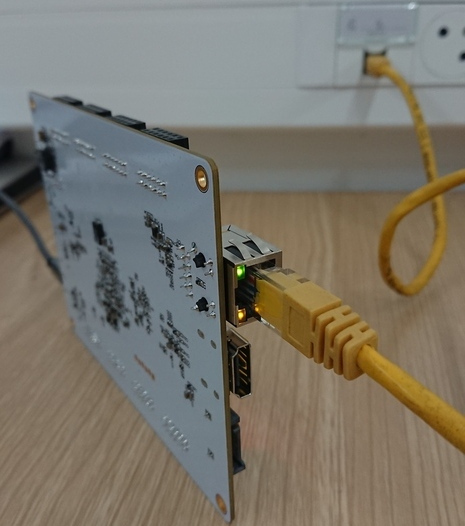

ECPIX-5 Tester
==============

FT4232
======

Test by pluging USB2 to PC:

    $ sudo dmesg -w

    [968380.785032] usb 5-1.1.4.4: new high-speed USB device number 19 using xhci_hcd
    [968380.956022] usb 5-1.1.4.4: New USB device found, idVendor=0403, idProduct=6011, bcdDevice= 8.00
    [968380.956025] usb 5-1.1.4.4: New USB device strings: Mfr=1, Product=2, SerialNumber=0
    [968380.956027] usb 5-1.1.4.4: Product: Quad RS232-HS
    [968380.956028] usb 5-1.1.4.4: Manufacturer: FTDI
    [968381.264162] ftdi_sio 5-1.1.4.4:1.0: FTDI USB Serial Device converter detected
    [968381.264176] usb 5-1.1.4.4: Detected FT4232H
    [968381.264437] usb 5-1.1.4.4: FTDI USB Serial Device converter now attached to ttyUSB0
    [968381.264599] ftdi_sio 5-1.1.4.4:1.1: FTDI USB Serial Device converter detected
    [968381.264609] usb 5-1.1.4.4: Detected FT4232H
    [968381.264963] usb 5-1.1.4.4: FTDI USB Serial Device converter now attached to ttyUSB1
    [968381.265110] ftdi_sio 5-1.1.4.4:1.2: FTDI USB Serial Device converter detected
    [968381.265119] usb 5-1.1.4.4: Detected FT4232H
    [968381.265313] usb 5-1.1.4.4: FTDI USB Serial Device converter now attached to ttyUSB2
    [968381.265495] ftdi_sio 5-1.1.4.4:1.3: FTDI USB Serial Device converter detected
    [968381.265505] usb 5-1.1.4.4: Detected FT4232H
    [968381.265718] usb 5-1.1.4.4: FTDI USB Serial Device converter now attached to ttyUSB3

    $ minicom --baudrate 1000000 -D /dev/ttyUSB2
        No Hardware flow control
        
    $ openFPGALoader --cable ft4232 --bitstream release/top_45.bit

Flash SPI
=========

    $ openFPGALoader --cable ft4232 --write-flash --bitstream release/top_45.bit 
    write to flash
    Jtag frequency : requested 6.00MHz   -> real 6.00MHz
    Enable configuration: DONE
    SRAM erase: DONE
    Open file DONE
    Parse file DONE
    Detail: 
    Jedec ID          : 9d
    memory type       : 60
    memory capacity   : 19
    EDID + CFD length : 9d
    EDID              : 1960
    CFD               : 
    Erasing: [==================================================] 100.00%
    Done
    Writing: [==================================================] 100.00%
    Done
    Refresh: DONE

RGB LEDs
========

Visual test: 4 LEDs blinking Red, Green, Blue.

 

PMOD
====

Test with 7 segment: Blinking "8" on all PMODs.

SDCard
======

Test with 7 segment + SDcard flex and breakout: Blinking "0".

DDR
===

    --========== Initialization ============--
    Initializing SDRAM @0x40000000...
    Switching SDRAM to software control.
    Read leveling:
      m0, b00: |11100000| delays: 01+-01
      m0, b01: |00000000| delays: -
      m0, b02: |00000000| delays: -
      m0, b03: |00000000| delays: -
      best: m0, b00 delays: 01+-01
      m1, b00: |11100000| delays: 01+-01
      m1, b01: |00000000| delays: -
      m1, b02: |00000000| delays: -
      m1, b03: |00000000| delays: -
      best: m1, b00 delays: 01+-01
    Switching SDRAM to hardware control.
    Memtest at 0x40000000 (2.0MiB)...
      Write: 0x40000000-0x40200000 2.0MiB
       Read: 0x40000000-0x40200000 2.0MiB
    Memtest OK
    Memspeed at 0x40000000 (Sequential, 2.0MiB)...
      Write speed: 10.7MiB/s
       Read speed: 9.3MiB/s

ULPI
====

Test by pluging USB-C to PC::

    $ sudo dmesg -w

    [968390.653012] usb 5-1.1.3: New USB device found, idVendor=16d0, idProduct=0f3b, bcdDevice= 0.00
    [968390.653014] usb 5-1.1.3: New USB device strings: Mfr=1, Product=2, SerialNumber=3
    [968390.653015] usb 5-1.1.3: Product: Test Device
    [968390.653016] usb 5-1.1.3: Manufacturer: LUNA
    [968390.653017] usb 5-1.1.3: SerialNumber: 1234

USB-C
=====

Not tested.

HDMI
====

Test with screen.

Ethernet
========

Test with cable. Need both LEDs Orange and Green for gigabit link.

Sata
====

Not tested.
